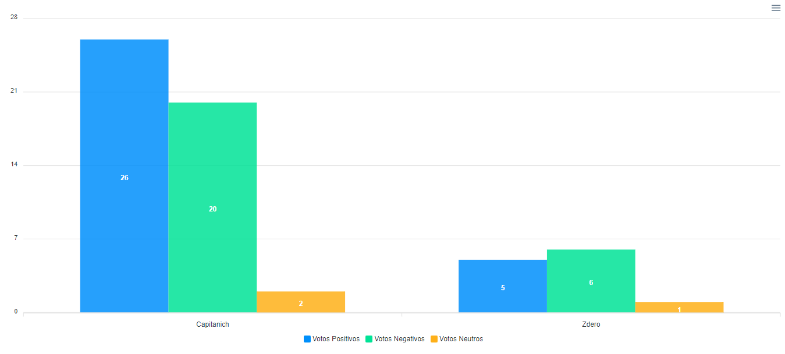

# Analisis del Trafico en Twitter

_Integrando Twitter API, OpenAI API y Socket.io, se logra un analisis detallado y en tiempo real de tweets referidos a candidatos politicos, clasificandolos en Positivo, Negativo y Neutro. Lo podemos observar perfectamente plasmado en un simple grafico de barras_

